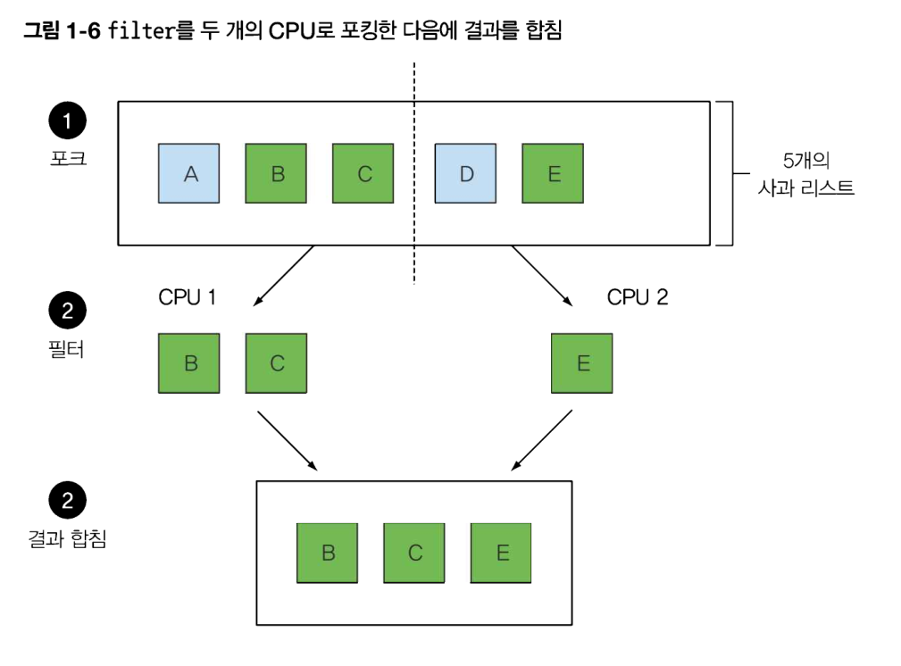

# 1.4 스트림

### 외부 반복

for each 루프를 통해 각 요소를 직접 반복하면서 작업을 수행

### 내부 반복

API를 사용하여 라이브러리 내부에서 알아서 최적화해서 작업을 수행하고 프로그래머는 'HOW'가 아닌 'WHAT'에만 집중하면 된다.

예시: 
```
SELECT * FROM table WHERE obj.x > 5;
```

DBMS에서 WHERE절을 알아서 최적화해서 수행한다.

## 1.4.1 멀티스레딩은 어렵다

라이브러리에서 반복되는 패턴을 제공한다면 좋을 것이다!

- filter
- extract
- grouping

등등..

### forking step



github fork나 process fork()처럼 둘로 나눈다.

fork의 사전적 정의:
(especially of a road or other route) divide into two parts

### stream과 parallelStream


위 코드와 같이 stream을 parallelStream으로 바꿔주기만 하면 

```
-Djava.util.concurrent.ForkJoinPool.common.parallelism=8
```

필요에 따라 최대 위와 같은 수의 스레드의 생성하여 멀티쓰레딩 연산을 수행한다.

### 인터페이스의 변경

Collection.list(list, comparator)

vs

list.sort(comparator)

후자가 이론적으로 더 적절하나, 번거롭게도 전자를 계속 써야만 했었다.

list에 sort메서드를 추가하고 싶었으나, 호환성의 문제 때문에 그럴 수 없었다.

Default method로 이 문제를 해결할 수 있다.