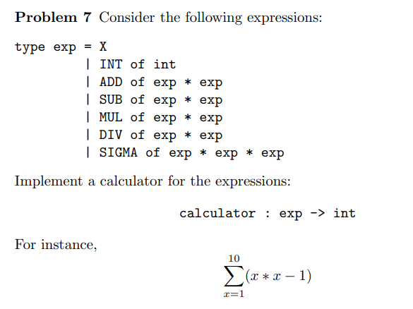
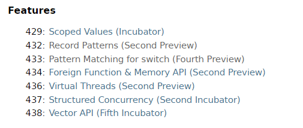

# 1.6 함수형 프로그래밍에서 가져온 다른 유용한 아이디어

## Optional

```java
if (obj != null && obj ...){
    ...
}
```
사용을 자제하자.

토니 호아레(quick sort의 발명자)는 2009년 QCon London에서 다음과 같은 말을 했다.

"널을 만든 건 정말 뼈아픈 실수였다."

### Null References - The Billion Dollar Mistake

<https://www.infoq.com/presentations/Null-References-The-Billion-Dollar-Mistake-Tony-Hoare/>

프로그래밍 언어에 모든 타입에 들어갈 수 있는 NULL이란 개념을 넣지 말았어야 했다.
NULL이 도입되면서 Null Pointer Exception은 온갖 버그를 일으켰다.
Null 대신 Optional을 사용한다면 해당 오류를 컴파일 타임에 잡아낼 수 있다.

참고: 프로그래밍 교육에서 실습 언어의 선택
<http://ropas.snu.ac.kr/~kwang/paper/position/edu.pdf>

자세한 설명은 11장에서 계속...

## Pattern Matching

보통 패턴 매칭이라고 하면 정규식 패턴 매칭 (regular expression pattern matching)를 떠올리고는 한다. 실제로 구글에 자바 패턴 매칭이라고 하면 regex에 대한 글이 아직까지는 더 많은 걸 확인할 수 있다.

이 책에서 소개하는 패턴 매칭은 모양새가 비슷해보여도 완전히 다른 개념이다.
단순히 string 패턴을 매칭하는 것이 아니라, 오브젝트 구조 자체를 매칭할 수 있어 특정 상황에서 조건문을 매우 간결하고 엄밀하게 작성할 수 있다.
If-then-else나 switch문보다 훨씬 강력한 고급 조건문을 만들 수 있다.

책에서는 패턴 매칭을 완벽하게 지원하지 않는다고 소개했지만, 자바가 점점 발전하면서 현대의 자바에서는 나름 성과를 거두고 있다.

참고:

- (책 링크) Pattern Matching Preview - 자바 14 <https://openjdk.org/jeps/305>
- Pattern Matching - 자바 16 <https://openjdk.org/jeps/394>
- Pattern Matching for switch Preview - 자바 19 <https://openjdk.org/jeps/427>
-

### 패턴매칭의 장점

1. 더 간결한 조건문을 작성할 수 있다.
1. 특정 언어나 상황에서 Exhaustive matching을 통해 프로그래머의 실수를 컴파일 타임에 방지할 수 있다.
   즉, 조건문에서 가능한 모든 경우를 프로그래머가 직접 명시하거나 예외 처리 해주지 않으면 컴파일 에러가 발생한다.

### java 에서의 패턴 매칭

```java
if (obj instance of String) {
   String s = (String) obj;
   if (s.length() > 5) {
      // ...
   }
}

// after pattern matching support

if (obj instanceof String s && s.length() > 5) {
   ...
}
```

위 코드 예시처럼 여러 줄을 필요로 하는 instanceof 체크와 캐스팅을 단 한 줄로 줄일 수 있다.

### 타 언어에서의 패턴 매칭



설명은 아주 간단한데 푸는 난이도는 그렇지 않은 간단한 계산기 문제이다.

이와 같은 문제를 패턴 매칭 없이 해결하기 위해 자바에서는 매번 수십 줄의 instanceof 체크와 캐스팅, if-else 문을 작성해야 한다.

그러나 책에서 언급된 하스켈, 오카멜 등의 함수형 언어에서 지원하는 강력한 패턴 매칭 기능을 사용하면 단 몇 줄로 코드를 줄일 수 있다.

#### Ocaml에서의 패턴 매칭

[위 문제에 대한 예시 Solution](calculator-ocaml/main.ml)

<https://try.ocamlpro.com>

위 링크에서 실행하면 된다.

#### Python에서의 패턴 매칭

<https://peps.python.org/pep-0636/>

```python
from dataclasses import dataclass

@dataclass
class Point:
    x: int
    y: int

def where_is(point):
    match point:
        case Point(x=0, y=0):
            print("Origin")
        case Point(x=0, y=y):
            print(f"Y={y}")
        case Point(x=x, y=0):
            print(f"X={x}")
        case Point():
            print("Somewhere else")
        case _:
            print("Not a point")
```

파이썬도 3.10 버전부터 훌륭한 패턴 매칭을 지원한다.

### java 패턴매칭의 미래

> Future JEPs will enhance the Java programming language with pattern matching for other language constructs, such as switch expressions and statements.

아직 다른 함수형 언어들에서 지원하는 강력한 패턴 매칭 기능들을 모두 지원하는 것은 아니지만, 이를 따라잡으려고 꾸준히 발전하고 있다.

<https://openjdk.org/projects/jdk/20/>



위는 2023년 3월 21일에 릴리즈된 자바 20의 기능들이다.

- Record Patterns
- Pattern Matching for switch

등 다양한 고급 패턴 매칭 기능들이 추가되고 있다.
시간이 남으면 살펴보자.

자바 20을 설치한 뒤 각각의 폴더에 들어가 다음과 같이 실행할 수 있다.


#### Pattern Matching for switch


#### Record Patterns


#### java pattern matching 아쉬운 점

아직 좀 더 유용한 형태의 Record Pattern을 지원하려면 많은 시간이 걸릴 것 같다.

``` java

void printSum(Object obj) {
    if (obj instanceof Point(1234, int _)) { // does not work...
      System.out.println("x is 1234");
    }
    else if (obj instanceof Point(int _, int _)) {
      ...
    }
}

```

위 수도 자바코드처럼 Object destructuring과 동시에 값을 비교할 수 있으면 더 유용할 것이다.


## Optional과 Pattern Matching을 동시에 설명하는 이유가 무엇일까?

둘을 같이 쓰면 유용하다!

``` java

Optional<ABC> maybeABC;
if (maybeABC instanceof ABC abc) {
   ...
} else {
   raise Exception!!!
}

```

위와 같이 사용한다면 
```java
ABC abc = maybeABC.get();
```
한 줄을 생략할 수 있다.

물론 현재는 패턴 매칭 기능이 빈약하기 때문에 옵셔널을 if-else문보다는 ifPresent, orElse 와 같은 내장 메서드와 함께 사용하는 것을 권장한다.

다른 언어에서는 위와 같이 Optional을 사용할 때에 else 문을 작성하지 않는다면 강제적으로 컴파일 에러를 발생시킨다. 이를 통해 안전하게 NullPointerException을 방지한다. (Exhaustive pattern matching)
