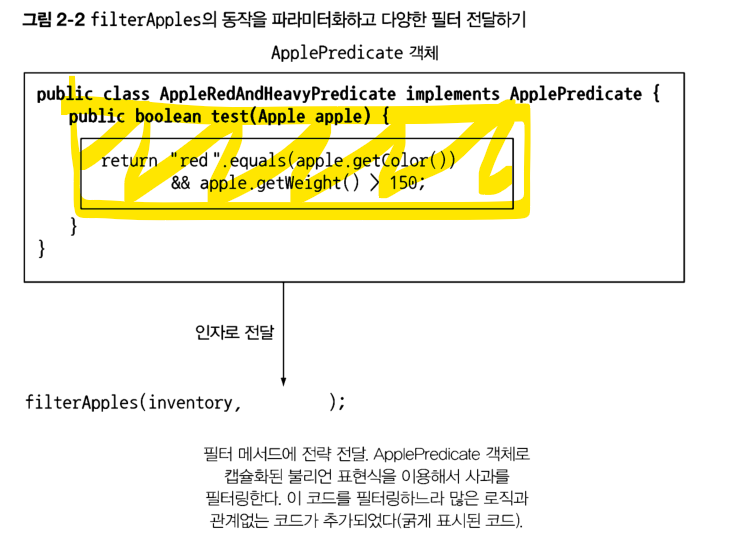
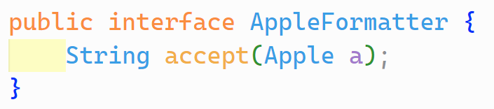

# 동작 파라미터화

참 또는 거짓을 반환하는 함수를 프레디케이트 (predicate) 라고 한다.

<https://www.cs.rochester.edu/u/nelson/courses/csc_173/predlogic/predicates.html#:~:text=A%20predicate%20is%20a%20boolean,a%20predicate%20with%20no%20arguments.>

사과를 인풋으로 받고 참, 거짓을 반환하는 ApplePredicate 인터페이스를 선언한다.


이후 다양한 버전의 ApplePredicate을 구현하면서 코어 로직과 필터링 로직을 분리할 수 있다.


이를 전략 디자인 패턴이라고 한다.

## 전략 디자인 패턴

Strategy pattern

<https://en.wikipedia.org/wiki/Strategy_pattern>

OCP를 지키는 패턴이다.

lambda를 사용할 수 없던 시절에 고대의 개발자들이 그와 비슷한 작업을 할 수 있도록 노력한 흔적이다. 현대에는 단순히 인자로 lambda를 넘겨주면 된다.

## 2.2.1 네 번째 시도: 추상적 조건으로 필터링


필터에서 프레디케이트를 사용하는 방법이다.

### 코드/동작 전달하기

동작 파라미터화의 장점: 컬렉션 탐색 로직과 각 항목에 적용할 동작을 분리할 수 있다.



결국 노란색으로 색칠된 로직이 중요한 부분이다. 그 주변에 public class, test메서드 등은 오직 고대 자바의 문법적 한계를 극복하기 위해 필요한 boilerplate 코드일 뿐이다.


## 퀴즈 2-1: 유연한 prettyPrintApple 메서드 구현하기

format printer도 매우 비슷한 방식으로 구현할 수 있다. test 대신 print 혹은 format string 하는 단일 함수를 가진 SAM (Single Abstract Method) 인터페이스를 만들면 된다.



## 실습

### 윈도우

 2-2 폴더에 들어가서 powershell을 연 뒤 ./run.ps1 을 실행하면 된다.

### 유닉스

> 주의: 테스트 해보지 않음.

터미널에서 ./run.sh를 실행하면 된다.

### 결과


## 추가로 생각해볼 점

다음은 위에서 언급된 위키피디아의 strategy pattern 항목 중 자바 예시 코드이다.

``` java
import java.util.ArrayList;
import java.util.List;
import java.util.function.IntUnaryOperator;

enum BillingStrategy {

    // Normal billing strategy (unchanged price)
    NORMAL (a -> a),
    // Strategy for Happy hour (50% discount)
    HAPPY_HOUR (a -> a/2),
    ;

    private final IntUnaryOperator strategy;

    BillingStrategy(IntUnaryOperator strategy) {
        this.strategy = strategy;
    }
    
    // Use a price in cents to avoid floating point round-off error
    int getActPrice(int rawPrice) {
        return this.strategy.applyAsInt(rawPrice);
    }

}

class CustomerBill {
    private final List<Integer> drinks = new ArrayList<>();
    private BillingStrategy strategy;

    public CustomerBill(BillingStrategy strategy) {
        this.strategy = strategy;
    }

    public void add(int price, int quantity) {
        this.drinks.add(this.strategy.getActPrice(price*quantity));
    }

    // Payment of bill
    public void print() {
        int sum = this.drinks.stream().mapToInt(v -> v).sum();
        System.out.println("Total due: " + sum);
        this.drinks.clear();
    }

    // Set Strategy
    public void setStrategy(BillingStrategy strategy) {
        this.strategy = strategy;
    }
}

public class StrategyPattern {
    public static void main(String[] arguments) {
        // Prepare strategies
        BillingStrategy normalStrategy    = BillingStrategy.NORMAL;
        BillingStrategy happyHourStrategy = BillingStrategy.HAPPY_HOUR;

        CustomerBill firstCustomer = new CustomerBill(normalStrategy);

        // Normal billing
        firstCustomer.add(100, 1);

        // Start Happy Hour
        firstCustomer.setStrategy(happyHourStrategy);
        firstCustomer.add(100, 2);

        // New Customer
        CustomerBill secondCustomer = new CustomerBill(happyHourStrategy);
        secondCustomer.add(80, 1);
        // The Customer pays
        firstCustomer.print();

        // End Happy Hour
        secondCustomer.setStrategy(normalStrategy);
        secondCustomer.add(130, 2);
        secondCustomer.add(250, 1);
        secondCustomer.print();
    }
}
```

굉장히 신기한 코드다. 링크에 있는 c#이나 python의 예시 코드는 책과 비슷한 패턴을 보여 친숙한데, 자바 코드는 그렇지 않다.

의도가 명확하지 않지만, 람다를 enum에 저장한 걸로 보아 자바8 이후의 코드로 추정된다.

람다를 따로 변수에 저장하기 번거로운 자바의 특성을 우회하기 위해 IntUnaryOperator에 저장한 다음에 재활용하려고 한 흔적이 돋보인다. 이런 방법도 있구나 싶다. 나중에 만나더라도 당황하지 말자.
